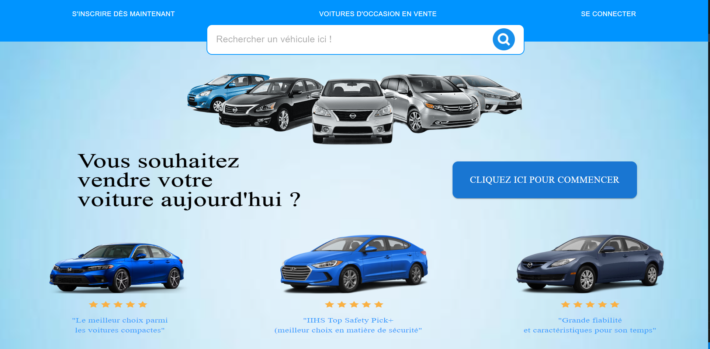
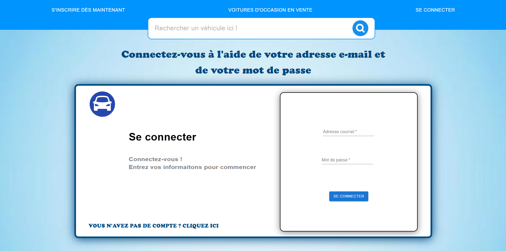
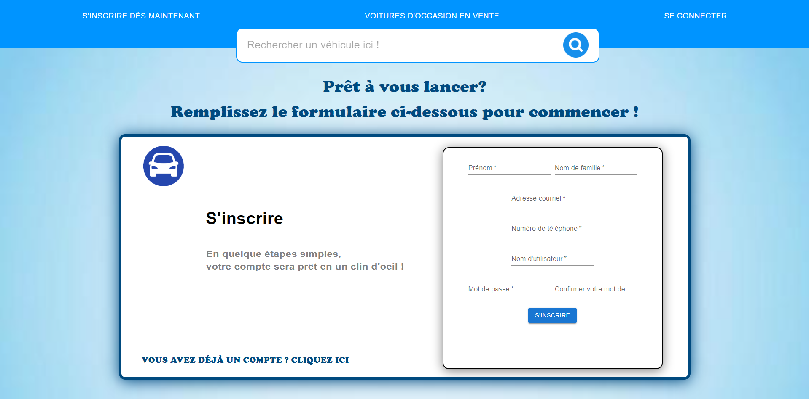
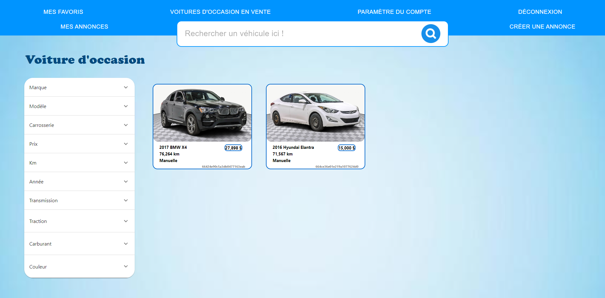
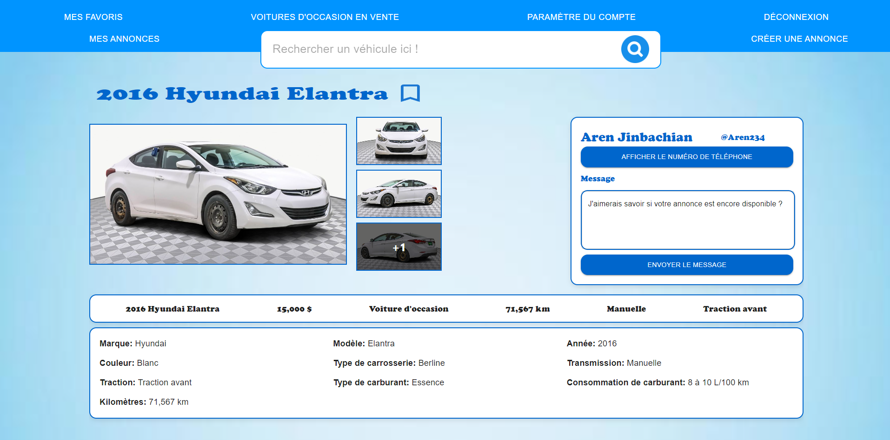
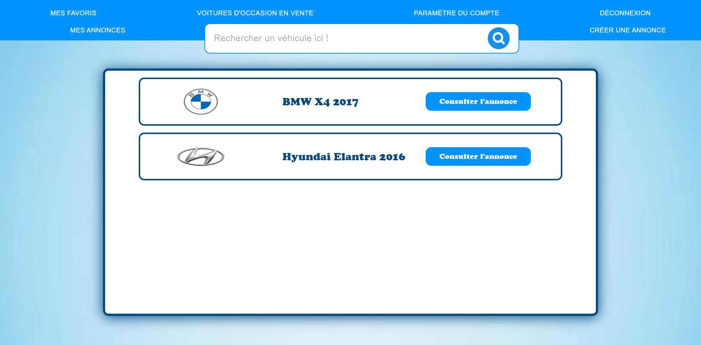

# AutoConnect

AutoConnect is a web application designed to create, manage, and view car listings. The project leverages a modern tech stack including Node.js, Express, and React with Material-UI for the frontend. This README file provides an overview of the project, its features, installation instructions, usage, and more.

## Table of Contents

- [Features](#features)
- [Installation](#installation)
- [Usage](#usage)
- [Project Structure](#project-structure)
- [Contributing](#contributing)
- [License](#license)

## Features

- **User Authentication**: Sign up, login, and manage user accounts with JWT-based authentication.
- **Ad Listings**: Create, view, and manage car advertisements.
- **Favorites**: Mark ads as favorites and view favorite ads.
- **Dynamic Filtering and Search**: Use a smart filter bar and search functionality to find ads.
- **Responsive Design**: The application is responsive and built with Material-UI for a modern look and feel.
- **Image Upload**: Upload car images with support for large image formats.

## Screenshots

### Home Page



### Login Page



### Registration Page



### Ad Listings



### Ad Details



### Favorites



## Installation

1. **Clone the repository**:

   ```sh
   git clone https://github.com/arenJ1nbachian/autoConnect.git
   cd autoConnect
   ```

2. **Install backend dependencies**:

   ```sh
   cd autoconnect_backend
   npm install
   ```

3. **Install frontend dependencies**:

   ```sh
   cd ../autoconnect_frontend
   npm install
   ```

4. **Set up environment variables**:
   Create a `.env` file in the `autoconnect_backend` directory with the following variables:

   ```env
   PORT=3000
   DB_CONNECTION_STRING=your_database_connection_string
   JWT_SECRET=your_jwt_secret
   ```

5. **Start the backend server**:

   ```sh
   cd autoconnect_backend
   npm start
   ```

6. **Start the frontend server**:
   ```sh
   cd ../autoconnect_frontend
   npm start
   ```

## Usage

1. **Access the application**:
   Open your browser and navigate to `http://localhost:3000`.

2. **Sign up or log in** to create, view, and manage car ads.

3. **Use the filter and search bar** to find specific car listings.

4. **Mark ads as favorites** to view them later in your favorites section.

### Commit History Highlights

- **Project Initialization**: Basic project setup with initial configurations.
- **Material-UI Integration**: Initialized Material-UI for frontend styling.
- **Routing Setup**: Implemented routing for navigation.
- **Search and Filter**: Added a search bar and dynamic filtering for ads.
- **User Authentication**: Implemented signup, login, and JWT-based authentication.
- **Ad Management**: Created functionality for creating, viewing, and managing ads.
- **Chat Feature**: Added chat context and preview window for user interactions.
- **Favorite Ads**: Implemented feature to mark and view favorite ads.
- **Error Handling**: Displayed errors received from the backend.
- **UI Enhancements**: Various CSS adjustments and UI improvements.

This README provides a comprehensive overview of the AutoConnect project, detailing its features, installation steps, usage, project structure, and more. It also highlights significant commits and contributions. Let me know if you need any further modifications or additional sections!
